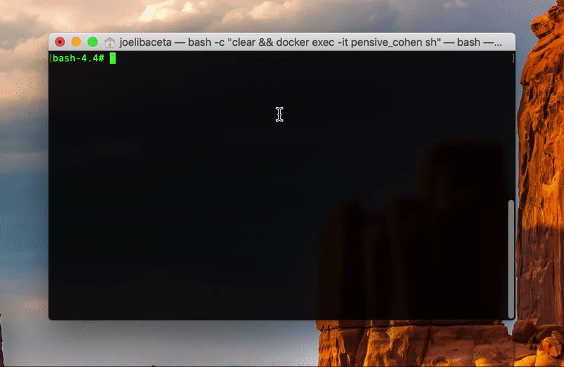
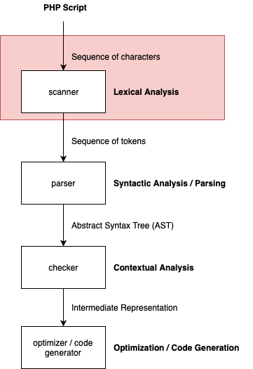

# Spanish PHP

This is the github mirror of the official PHP with internal modifications to build a custom spanish PHP (source code obtained from https://github.com/php/php-src)
 
_Esta es una copia del repositorio oficial de PHP con modificaciones internas para construir una versión personalizada en español de PHP._ (Código fuente obtenido de https://github.com/php/php-src)

<p align="center">
  
</p>

**Fibonacci Script**

```
<?php    

funcion Fibonacci($numero) {
    si ($numero == 0) {
        retornar 0;     
    } sinosi ($numero == 1) {
        retornar 1;     
    } sino {
        retornar (Fibonacci($numero-1) + Fibonacci($numero-2)); 
    }
}
  
$numero = 100; 
para ($contador = 0; $contador < $numero; $contador++) {   
    imprimir Fibonacci($contador) . " "; 
}

?>
```

## How it works / ¿Cómo Funciona?

<br/>

<center>

  

</center>

<br/>

The first step in the interpreter is the lexical analys over the script, a sequence of characters is translated into a sequence of tokens, identifying string patterns, here we can overwrite part of the lexical analyser to recognize words in spanish instead of the clasic keywords.

_El primer paso en el interprete es el análisis léxico sobre el script. Una secuencia de carácteres es traducida a una secuencia de tokens, identificando secuencias de carácteres. Aquí podemos sobre escribir parte del analizador sintáctico para reconocer palabras en español en lugar de las palabras clave clásicas._

